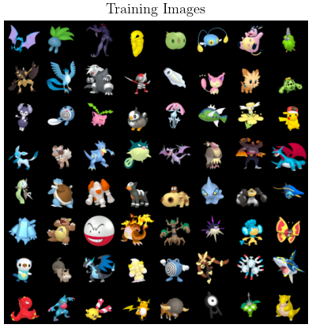
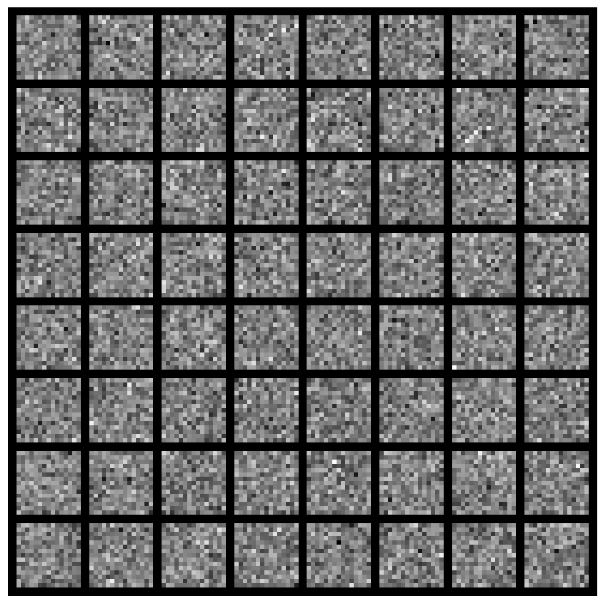
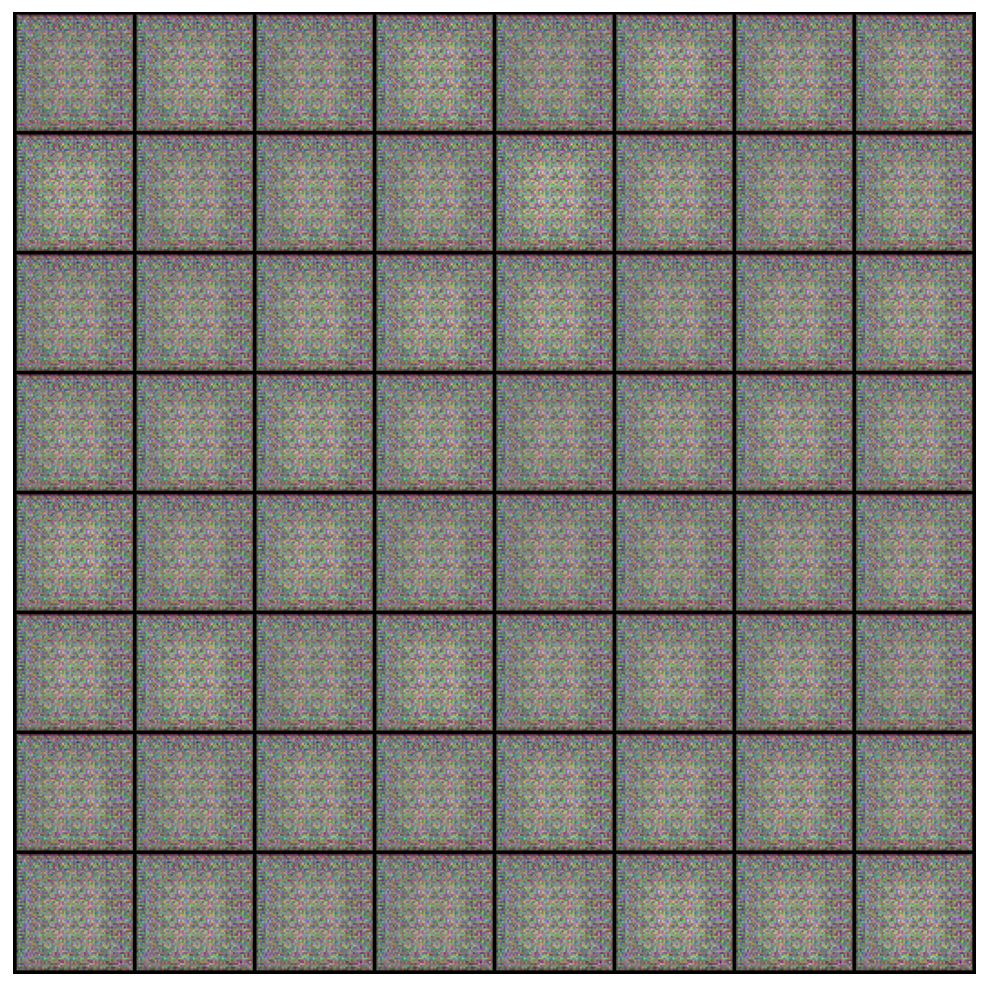
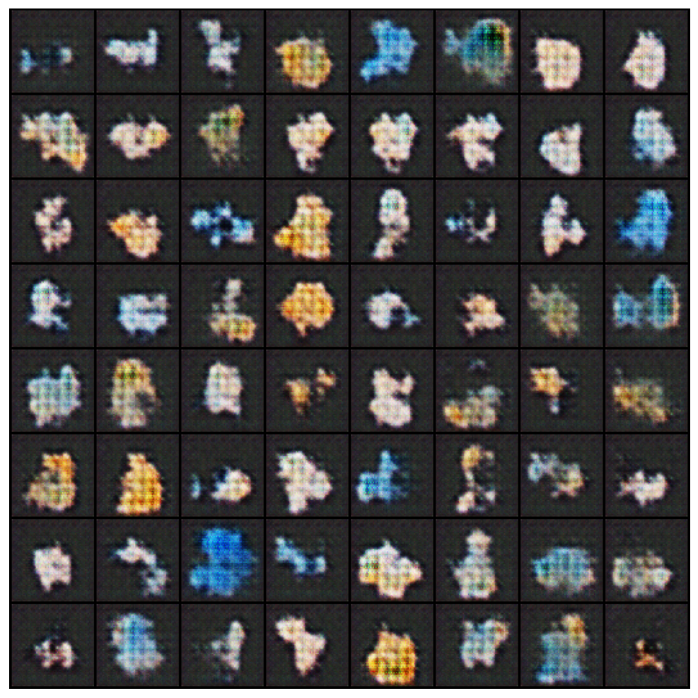
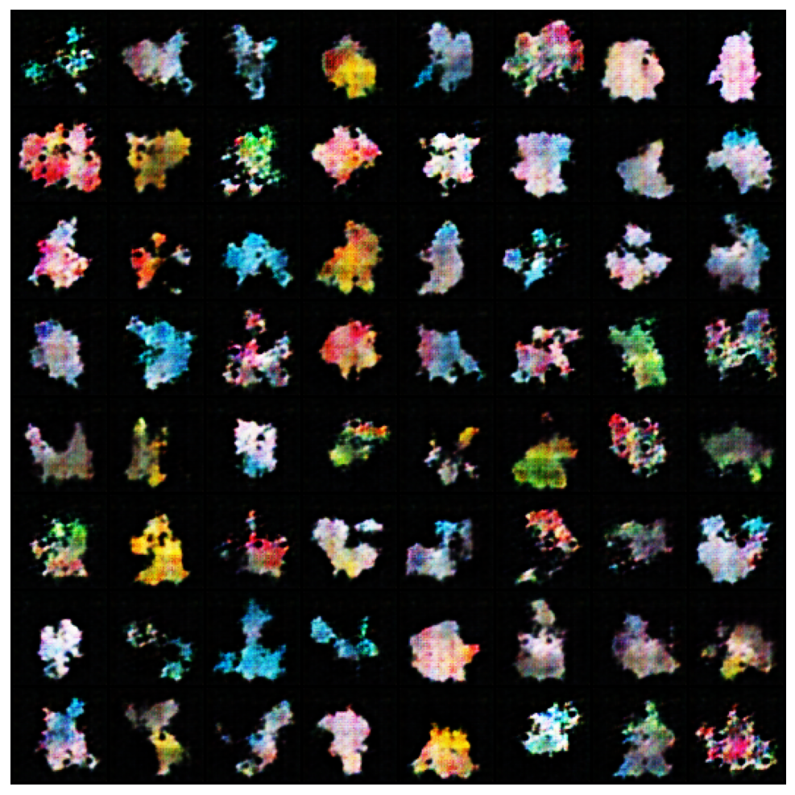
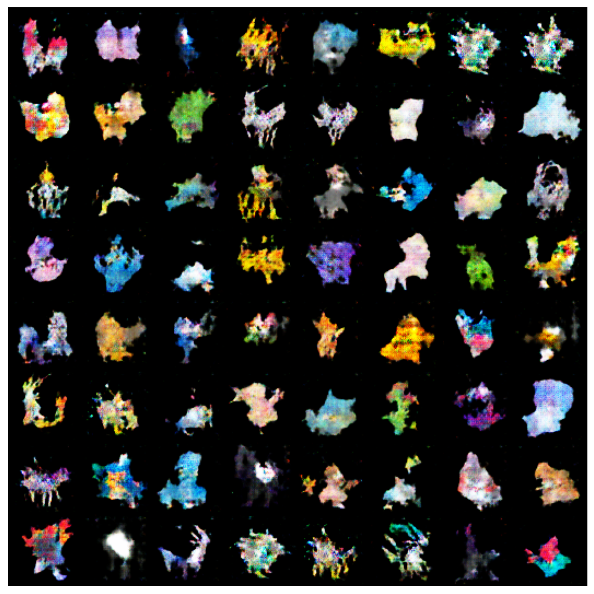
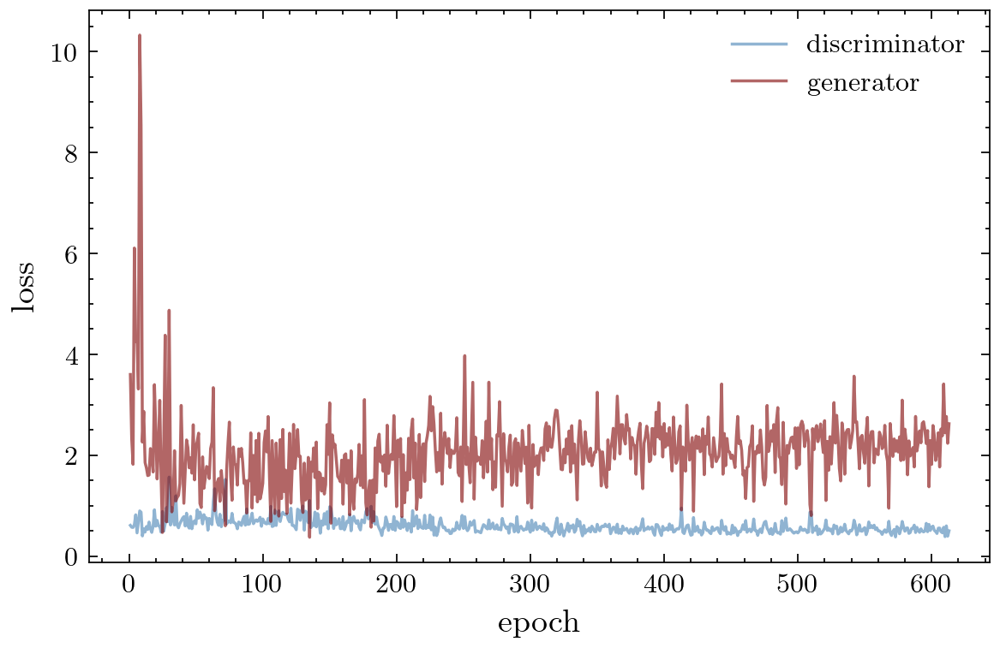
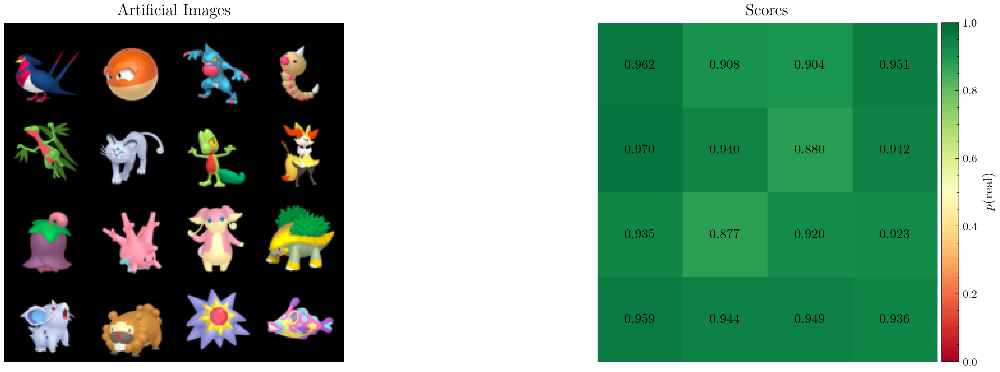
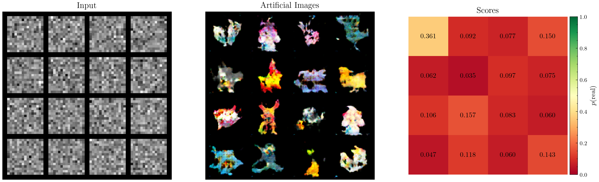

# PokeGAN
<br />
<p align="center">
  <a href="https://github.com/sephwalker321/PokeGAN">
  </a>
  <h3 align="center">Pokemon-GAN</h3>
</p>


<!-- TABLE OF CONTENTS -->
<details open="open">
  <summary>Table of Contents</summary>
  <ol>
    <li>
      <a href="#about-the-project">About The Module</a>
      <ul>
        <li><a href="#built-with">Built With</a></li>
      </ul>
    </li>
    <li>
      <a href="#getting-started">Getting Started</a>
      <ul>
        <li><a href="#prerequisites">Prerequisites and Installation</a></li>
      </ul>
    </li>
    <li><a href="#usage">Usage</a></li>
    <li><a href="#examples">Examples</a></li>
    <li><a href="#future">Future</a></li>
    <li><a href="#license">License</a></li>
    <li><a href="#contact">Contact</a></li>
  </ol>
</details>


<!-- ABOUT THE PROJECT -->
## About The Project

<p align="center">
  <a href="https://github.com/sephwalker321/PokeGAN">
  </a>
</p>

Python module containing custom classes of neutral network architectures for generating artificial pokemon sprites.

### Built With

The module was constructed using the following libraries,
* [Python](https://www.python.org/)

and the following data resources,

* [PokeAPI](https://github.com/PokeAPI/sprites)

* [PokemonCSV](https://www.kaggle.com/datasets/rounakbanik/pokemon)

<!-- GETTING STARTED -->
## Getting Started

To get a local copy up and running follow these simple example steps.

### Prerequisites and Installation

This is an example of how to list things you need to use the software and how to install them.

1. Clone the repo,
   ```
   git clone https://github.com/sephwalker321/PokeGAN
   ```

2. Install the requiremnts
  ```
  pip install -m requirements.txt
  ```
3. Install the module
  ```
  pip install -e .
  ```

<!-- USAGE EXAMPLES -->
## Usage
Jupyter Notebooks are provided for the demonstration of the training proceedure. 

1. Notebooks/train.ipynb load in data and train the GAN

User can add their own training images in data/sprites. Many default parameters of the module can be altered in pokegan/config.yaml

## Examples
In the notebook example we introduce a set of simple on-the-fly image augmentations to effectively increase the dataset size or reduce its complexity.

1. Alpha mask filter (4xHxW -> 3xHxW)

2. Random rotations

3. Random horizontal flipping

4. Resize to 3x32x32 Images

5. Image normalisation

This yeilds an example batch,

<p align="center">

</p>

Now we create the GAN. We create the generator and discrimator and wrap them into a custom GAN class and begin the training. We feed the generator with a noisy vector input which we can represent graphically, 

<p align="center">

</p>

The generator transforms this random noise into a new pokemon sprite which attempts to deceive the discriminator. Over time the generator compares the training images and the artifical images to trys to classify them. Over time they both improve.
Here are some example generated images over time for 10, 50, 100 and 500 epochs.

<p align="center">
   
</p>

Over the training time we can plot the losses of the two networks, 

<p align="center">

</p>

Lastly, lets see how the discriminator performs by comparing a heatmap of the discriminator scores against some example fake and real images,

<p align="center">


</p>

<!-- FUTURE -->
## Future
1. Take the epoch plots to create a video of the training proceedure
2. Study the latent space representation of the noise
3. Can we add a further input for the pokemon types to enhance the GAN?

<!-- LICENSE -->
## License

Distributed under the MIT License. See `LICENSE` for more information.


<!-- CONTACT -->
## Contact

For any issues or questions contact Joseph Walker

Project Link: https://github.com/sephwalker321/PokeGAN](https://github.com/sephwalker321/PokeGAN)
